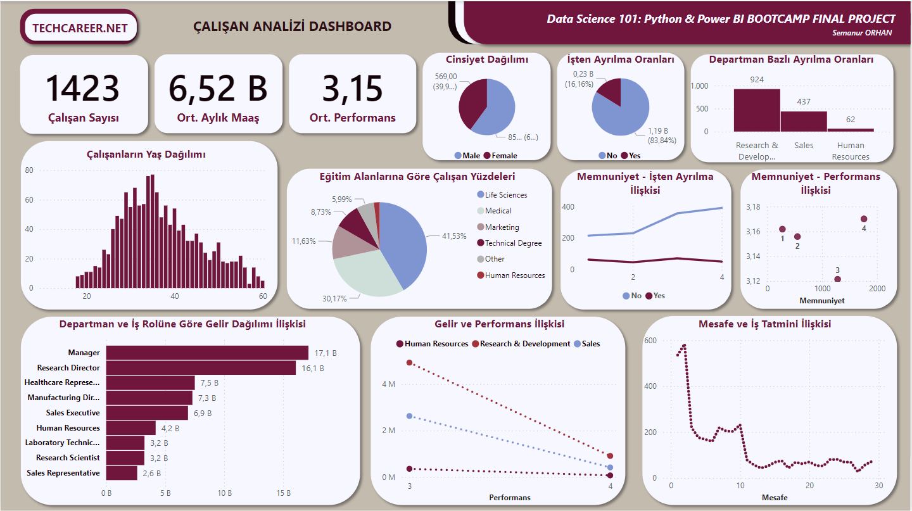

# HR Analytics Dashboard & Python Integration

## Proje Açıklaması
Bu proje, çalışanları analiz etmek için oluşturulmuştur. Python kullanılarak veri işleme ve analiz süreçleri gerçekleştirilmiş, Power BI kullanılarak görsel dashboard'lar oluşturulmuştur. Proje, HR departmanlarının çalışanlarla ilgili içgörüler elde etmesine yardımcı olmayı hedeflemektedir.

## Analiz Hedefleri

Bu veri seti kullanılarak aşağıdaki analizler yapılabilmektedir:
1. Demografik dağılımlar (yaş grubu, eğitim alanı, vb.)
2. İşten ayrılma (Attrition) oranları ve performans ilişkisi
3. Gelir analizi ve departmanlara göre karşılaştırmalar
4. Ev-iş mesafesi ile iş tatmini arasındaki ilişkilersafesi ile iş tatmini arasındaki ilişkiler

## İçerik
- **Python Dosyası**: Verinin işlenmesi, analiz edilmesi ve modelleme süreçlerini içerir.
- **Power BI Dashboard**: Çalışanlar ile ilgili görselleştirilmiş raporlar ve içgörüler sunar.
- **Veri Seti**: Projede kullanılan veri seti, çalışan bilgilerini ve ilgili parametreleri içerir.

